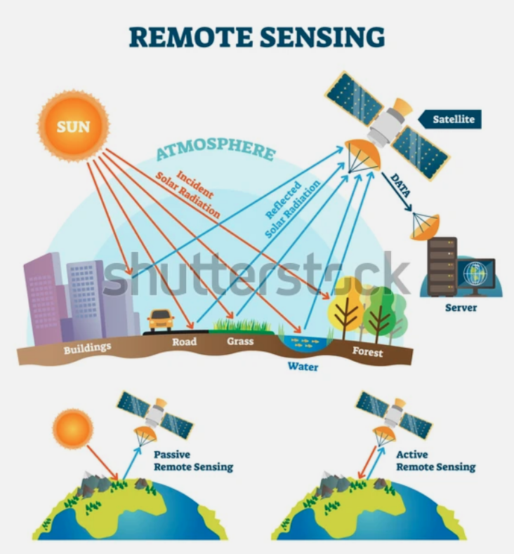
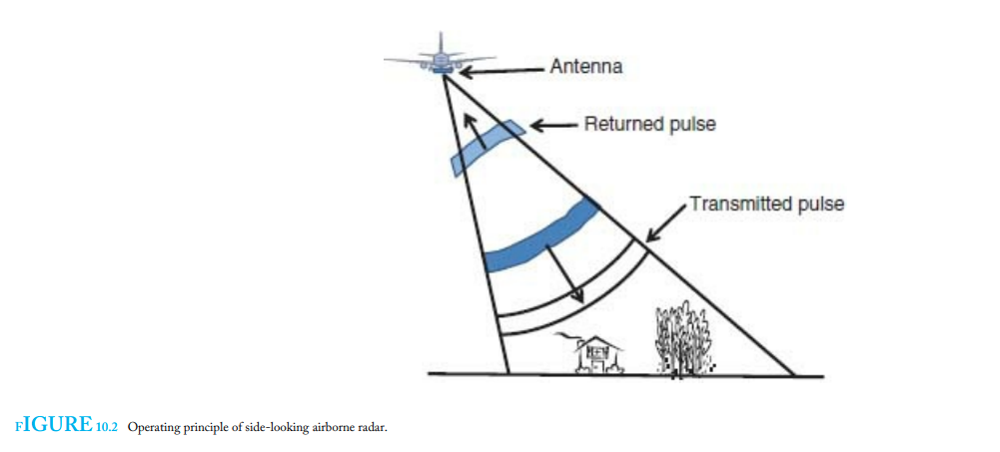
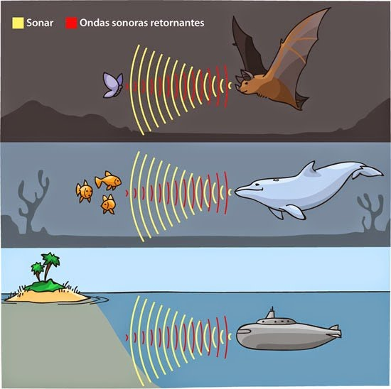

# Clase Introductoria a SAR

<h1>Introducción al Radar de Apertura Sintética (SAR)</h1> 
<h2>Por: Cristian Aguilar-Barboza</h2> 

Este material está destinado para los estudiantes del curso de Teledetección de la Escuela de Geografía de la UCR 2021.

Ante cualquier duda o sugerencia: andresaguilarba20@gmail.com

Índice
 

<li><a href="#Sección1">1. Sensores activos vs sensores pasivos</a></li>
 <li><a href="#Sección2">2. Las microondas </a></li>
<li><a href="#Sección3">2. Parametros del sensor</a></li>
<li><a href="#Sección4">3. Parametros de la cobertura</a></li>
<li><a href="#Sección5">4. Errores y distorciones geométricas y radiométricas</a></li>
<li><a href="#Sección6">5. Interpretando una imágen SAR</a></li>

<h2 id="Sección1">1. Sensores activos vs sensores pasivos</h2>

En los sensores pasivos se aprovecha la energía solar. Miden la energía reflejada por las coberturas en la superficie terrestre en múltiples longitudes de onda o bandas. 
 

<h4 id="Sección1">Fig 1.Sistema de teledetección pasiva (Weng, 2012).</h4>

Los sensores activos tienen la capacidad de emitir su propia energía en forma de un pulso electromagnético y medir la señal reflejada por el área iluminada.  
 

<h4 id="Sección1">Fig 2.Sistema de teledetección activa (Weng, 2012).</h4>

 Todo sistema activo se basa en el principio de <strong>ecolocalización</strong>, mismo que utilizan las poblaciones de murciélagos y delfines, o el que podemos encontrar en sonares o en radares meteorológicos. Con esta técnia podemos averiguar la distancia entre un punto emisor y un objetivo a partir del tiempo que dura el pulso en ir y volver. Más adelante, aprenderemos que también es posible obtener otro tipo de información de este mecanismo y que es vital para la formación de imagenes SAR.
 

<h4 id="Sección1">Fig 3.Principio de ecolocalización (Weng, 2012).</h4>

<h2 id="Sección2">2. Las microondas</h2>

 La <strong>energía electromagnética</strong>,se transmite de un lugar a otro siguiendo un modelo armónico y continuo a la velocidad de la luz. Esta energia electromagnética está compuesta por dos campos o fuerzas ortogonales:<strong> el campo eléctrico y el campo magnético</strong>. Esta energía se propaga en forma de ondas
 

 Describimos una onda mediante su longitud de onda (λ) y su frecuencia (F). No obstante, en SAR nos interesan dos parámetros más: la amplitud de la onda (A) y la fase de la onda (φ).
 

 λ: El periodo espacial sobre el que se repite la función (la distancia entre crestas)
F: Número de ciclos por unidad de tiempo. 
A: La potencia o fuerza de la onda. 
φ: Describe en qué fase de ciclo se encuentra la onda. La fase inicial define la etapa de la que sale la onda. El uso de la fase no lo evaluaremos acá, pero  es importante que es un parámetro importante. 

