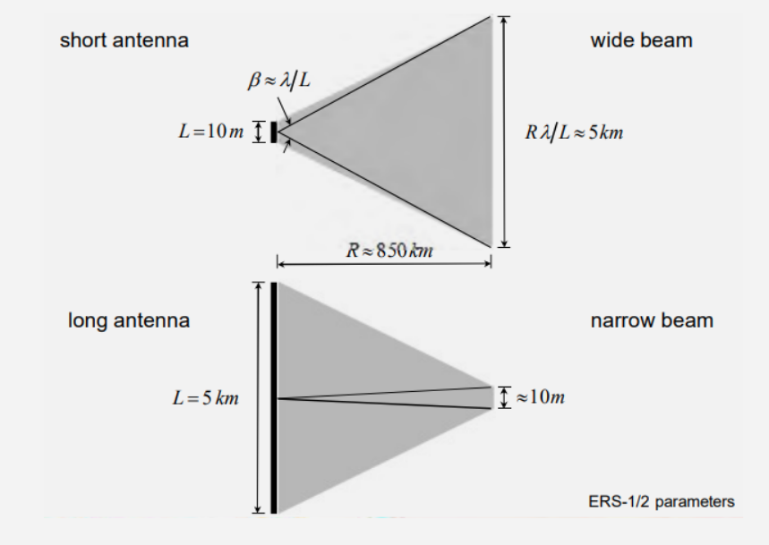

# Clase Introductoria a SAR

<h1>Introducción al Radar de Apertura Sintética (SAR)</h1> 
<h2>Por: Cristian Aguilar-Barboza </h2> 


<p>Este material está destinado para los estudiantes del curso de Teledetección de la Escuela de Geografía de la UCR 2021.</p>
<p>Ante cualquier duda o sugerencia: andresaguilarba20@gmail.com</p>

<p>Índice</p> 

<p><li><a href="#Sección1">1. Sensores activos vs sensores pasivos</a></li>
 <li><a href="#Sección2">2. Las microondas y SAR </a></li>
  <li><a href="#Sección3">3. Geometría del SAR</a></li>
<li><a href="#Sección4">4. Parametros del sensor</a></li>
<li><a href="#Sección5">5. Parametros de la cobertura</a></li>
<li><a href="#Sección6">6. Errores y distorciones geométricas y radiométricas</a></li>
<li><a href="#Sección7">7. Interpretando una imágen SAR</a></li>


<p><h2 id="Sección1">1. Sensores activos vs sensores pasivos</h2></p>

<p>En los sensores pasivos se aprovecha la energía solar. Miden la energía reflejada por las coberturas en la superficie terrestre en múltiples longitudes de onda o bandas. </p> 

<h4 id="Sección1">Fig 1.Sistema de teledetección pasiva (Weng, 2012).</h4>

<p>Los sensores activos tienen la capacidad de emitir su propia energía en forma de un pulso electromagnético y medir la señal reflejada por el área iluminada.  </p> 

<h4 id="Sección1">Fig 2.Sistema de teledetección activa (Weng, 2012).</h4>

<p> Todo sistema activo se basa en el principio de <strong>ecolocalización</strong>, mismo que utilizan las poblaciones de murciélagos y delfines, o el que podemos encontrar en sonares o en radares meteorológicos. Con esta técnia podemos averiguar la distancia entre un punto emisor y un objetivo a partir del tiempo que dura el pulso en ir y volver. Más adelante, aprenderemos que también es posible obtener otro tipo de información de este mecanismo y que es vital para la formación de imagenes SAR.</p> 

<h4 id="Sección1">Fig 3.Principio de ecolocalización.</h4>

<p><h2 id="Sección2">2. Las microondas y SAR</h2></p>

<p> La <strong>energía electromagnética</strong>,se transmite de un lugar a otro siguiendo un modelo armónico y continuo a la velocidad de la luz. Esta energia electromagnética está compuesta por dos campos o fuerzas ortogonales:<strong> el campo eléctrico y el campo magnético</strong>. Esta energía se propaga en forma de ondas</p> 

<p> Describimos una onda mediante su longitud de onda (λ) y su frecuencia (F). No obstante, en SAR nos interesan dos parámetros más: la amplitud de la onda (A) y la fase de la onda (φ).</p> 

<p> λ: El periodo espacial sobre el que se repite la función (la distancia entre crestas)</p>
<p>F: Número de ciclos por unidad de tiempo.</p>
<p>A: La potencia o fuerza de la onda.</p>
<p>φ: Describe en qué fase de ciclo se encuentra la onda. La fase inicial define la etapa de la que sale la onda. El uso de la fase no lo evaluaremos acá, pero  es un parámetro importante en Interferometría de Radar o INSAR.</p>


<h4 id="Sección2">Fig 4. Caracteristicas de una onda (Weng, 2012).</h4>
<p>Las ondas electromagnéticas en el espectro de las microondas suelen tener λ superior a los 3 cm (10 GHz). Mucho mayores que las utilizadas en el espectro visible e infrarrojo. 

Esto implica también que estas ondas tienen una menor frecuencia y menor energía.</p>


<h4 id="Sección2">Fig 5. Espectro electromagnético (Chuvieco, 2007).</h4>

<p>En estas longitudes de onda la atmósfera es "transparente", por lo que la nubosidad u otras distorsiones atmosféricas no son un problema al adquirir imágenes radar independientemente de si es un sensor activo o pasivo.</p>

<p>El espectro del microondas se encuentra en una ventana atmosférica, lo que permite que gran parte de la señal se transmita hasta la superficie terrestre. Estas ventanas atmosféricas son el equivalente de lo que llamamos bandas y es una de las principales razones por la que existe la teledetección.</p> 


<h4 id="Sección2">Fig 6. Ventanas atmosféricas (Woodhouse, 2006).</h4>

<p><h2 id="Sección3">3. Geometría básica del SAR</h2></p>

<p> Los SLAR o radares aéreos de visión lateral fueron desarrollados con fines militares a mediados del siglo XX. Se basan en la observación lateral de una antena que es transportada por una aeronave. Representaban la capacidad de detectar objetos por debajo de coberturas. Estos sensores transmiten haces estrechos en forma de abanico desde el avión. </p> 
<p>  Swat: describe la anchura de la franja de la superficie de la tierra que es iluminada por el radar.  </p>
<p>  Rango o alcance: Distancia entre el radar y cada objeto iluminado. Permite distinguir objetos en diferentes rangos. </p>
<p> Azimuth: permite distinguir objetos en la dirección del azimut o vuelo del sensor.   </p>
<p> Ángulo de incidencia: es el ángulo definido por el haz de radar incidente y la vertical con respecto a la superficie. Luego veremos como el ángulo de incidencia juega un papel primordial en las mediciones con SAR. </p>


<h4 id="Sección3">Fig 7. Radares aereos de visión lateral (Woodhouse, 2006).</h4>

<p> La huella de iluminación (tamaño de píxel) de una imagen SAR va depender de la longitud de la antena L, la longitud de onda λ y la distancia entre la superficie y el sensor R. Entre mayor sea la distancia entre la superficie y el sensor, mayor debe ser la longitud de la antena para tener una huella de iluminación útil.</p>

<p>Esta situación supuso uno de los mayores retos para la generación de imágenes SAR.</p>  


<h4 id="Sección3">Fig 8. Tamaño de la antena (Meyer, 2021).</h4>

<p> El uso del “efecto doppler” permitió lo que se conoce como la apertura sintética, que se basa en que una pequeña antena alcance la resolución efectiva de una antena mucho mayor, lo que permitió la puesta en orbita de satélites con antenas SAR. Esta innovación se le atribuye Carl Wiley.</p> 

<h4 id="Sección3">Fig 9. Radar de Apertura Sintética (Flores-Anderson et al., 2020).</h4>

<p><h2 id="Sección4">4. Parámetros del Sensor </h2></p>

<p><strong>¿Qué mide un sensor SAR?</strong></p> 

<p>Mide el retorno de la señal electromagnética que regresa en dirección del sensor posterior a interactuar con la superficie. Esta magnitud es conocida como <strong>retrodispersión </strong>, aunque también se le denomina <strong>sección transversal del radar (RCS por sus siglas en inglés)</strong>.</p> 
<p></p> 

<h4 id="Sección3">Fig 10. Coeficiente de retrodispersión (Flores-Anderson et al., 2020).</h4>

<p> La cantidad de energía que regrese al sensor va depender de una serie de factores ligados a las <strong> características del sensor y de la superficie</strong>.</p> 

<strong>a. Ángulo de incidencia </strong>
<p>Diferencias en el ángulo de incidencia hará que más o menos señal pueda retornar en dirección del sensor.</p> 


<h4 id="Sección3">Fig 11. Ángulos de Incidencia (Flores-Anderson et al., 2021).</h4>

<p>Copie y pegue este código en GEE</p> 

```javascript
// Define the time interval.
var start_date = ee.Date('2019-07-26');
var end_date = start_date.advance(20, 'days');
var date_filter = ee.Filter.date(start_date, end_date);

// Define the base Sentinel-1 collection.
var collection_base = ee.ImageCollection('COPERNICUS/S1_GRD')
    .filter(date_filter)
    .filter(ee.Filter.eq('instrumentMode', 'IW'))
    .filter(ee.Filter.listContains('transmitterReceiverPolarisation', 'VV'))
    .select(['VV','angle']);
 
// Define the data layers.
var label1 = 'Ascending Orbit';
var label1_vv = 'Ascending Orbit - angle';
var collection1 = collection_base
    .filter(ee.Filter.eq('orbitProperties_pass', 'ASCENDING'));
var vis_params1 = {bands:'VV', min:-25, max:5};
var vis_params1_angle = {bands:'angle', min:18.3, max:46.8};

var label2 = 'Descending Orbit';
var label2_vv = 'Descending Orbit - angle';
var collection2 = collection_base
    .filter(ee.Filter.eq('orbitProperties_pass', 'DESCENDING'));
var vis_params2 = {bands:'VV', min:-25, max:5};
var vis_params2_angle = {bands:'angle', min:18.3, max:46.8};

// Create the map objects, link them, and display them.
var map1 = ui.Map().add(ui.Label(label1, {position:'middle-left'}));
map1.addLayer(collection1, vis_params1, label1, true);
map1.addLayer(collection1, vis_params1_angle, label1_vv, false);

var map2 = ui.Map().add(ui.Label(label2, {position:'middle-right'}));
map2.addLayer(collection2, vis_params2, label2, true);
map2.addLayer(collection2, vis_params2_angle, label2_vv, false);

var linker = ui.Map.Linker([map1,map2]);
var split_panel = ui.SplitPanel({
  firstPanel: map1,
  secondPanel: map2,
  wipe: true,
});

// Add the split panel to the UI.
ui.root.widgets().reset([split_panel])
```

<strong> Lóngitud de Onda</strong>
<p>Igual que en los sensores ópticos en SAR también se definen bandas acorde a la longitud de onda, aunque estos usualmente solo capturan información en una banda determinada. La longitud de onda definirá la interacción de la señal con la superficie, por ejemplo, la capacidad de penetración de la señal en la cobertura, además de que tan rugosa se percibirá ante el sensor.  </p> 


<h4 id="Sección3">Fig 12.Bandas en SAR (Flores-Anderson et al., 2021).</h4>


<h4 id="Sección3">Fig 13.Capacidad de penetración (EO College, 2020).</h4>


<strong>Polarización</strong>


<p>Recuerde que al inicio mencionamos que una onda está compuesta por un campo eléctrico y uno magnético. La orientación del campo eléctrico nos indica la polarización. En SAR usualmente se trabaja con polarizaciones lineales, esto quiere decir que el campo eléctrico puede ser transmitido tanto Vertical (V), como horizontal (H), de igual forma, se puede medir el retorno en Vertical o Horizontal.</p> 

<p>Esto nos da las combinaciones típicas de polarización VV, VH, HH y HV.</p> 


<h4 id="Sección4">Fig 14.Polarización (Flores-Anderson et al., 2020).</h4>

<p>Copie y pegue en GEE.</p> 

```javascript
var collectionVH = ee.ImageCollection('COPERNICUS/S1_GRD')
.filter(ee.Filter.eq('instrumentMode', 'IW'))
.filter(ee.Filter.listContains('transmitterReceiverPolarisation', 'VH'))
.filter(ee.Filter.eq('orbitProperties_pass', 'DESCENDING'))
.filterMetadata('resolution_meters', 'equals' , 10)
.filterDate('2020-10-15', '2020-11-27')
.filterBounds(roi)
.select('VH');
print(collectionVH, 'Collection VH');

var collectionVV = ee.ImageCollection('COPERNICUS/S1_GRD')
.filter(ee.Filter.eq('instrumentMode', 'IW'))
.filter(ee.Filter.listContains('transmitterReceiverPolarisation', 'VV'))
.filter(ee.Filter.eq('orbitProperties_pass', 'DESCENDING'))
.filterMetadata('resolution_meters', 'equals' , 10)
.filterDate('2020-10-15', '2020-11-27')
.filterBounds(roi)
.select('VV');
print(collectionVV, 'Collection VV');


// Display map
Map.addLayer(collectionVH, {min:-25,max:0}, 'VH mosaic', 0);
Map.addLayer(collectionVV, {min:-25,max:0}, 'VV mosaic', 0);

```

<p><h2 id="Sección5">5. Parámetros de la cobertura </h2></p>
<strong> Constante Dialéctrica</strong>

<p>En teledetección la mayoría de materiales sólidos no son conductores,  estos materiales  los conocemos como dieléctricos. Cuando una onda viaje por un medio dieléctrico pierde energía (atenuación). Esta atenuación es exponencial, por lo que la onda pierde amplitud al propagarse por el medio (atmósfera y superficie terrestre).</p> 

<p>La constante dieléctrica es un indicador de la reflectividad y conductividad de la superficie. Por tanto, nos permite inferir que tanta energía de la onda electromagnética se dispensará o absorberá al interactuar con una superficie. Se suele expresar con valores de 0 a 80, donde los materiales más secos tienen menor C. dieléctrica y el agua abierta la mayor. </p> 


<h4 id="Sección4">Fig 16.Constante dialectrica y penetración (Meyer, 2021).</h4>


<h4 id="Sección4">Fig 17.Composición de un suelo (Meyer, 2021).</h4>

<strong> Densidad y orientación de la cobertura</strong>
<p>Cómo esté orientada una cobertura o su densidad tendrá un impacto directo en la dispersión de la energía de microondas. </p> 


<h4 id="Sección4">Fig 18.Estructura de una cobertura (Meyer, 2021).</h4>

<strong>Rugosidad </strong>

<p>Que tán rugosa sea una superficie determinará cuánta energía se dispersa de una superficie y su dirección. Aunque el nivel de rugosidad visto por un SAR dependerá de la longitud de onda (banda) y del ángulo de incidencia del sensor. Conforme aumente la longitud de onda más lisa será una cobertura en una imágen SAR.</p>


<h4 id="Sección4">Fig 19.Rugosidad de la superficie (Woodhouse, 2006).</h4>

<p><h2 id="Sección6">6. Errores y distorciones radiométricas y geométricas</h2></p>

<strong> Moteado o Speckle </strong>
<p>Cambios significativos en los niveles de gris entre celdas o píxeles adyacentes. La retrodispersión de cada pixel es el resultado de la suma coherente de las contribuciones de todos los elementos que componen una celda de resolución.</p> 


<h4 id="Sección6">Fig 20.Rugosidad de la superficie (EOCollege, 2020).</h4>

<p>Copie este código bajo en anterior</p> 

```javascript
//Create a mosaic
var VH_image = collectionVH.mosaic();
var VV_image = collectionVV.mosaic();

//Apply filter to reduce speckle
var SMOOTHING_RADIUS = 50;
var VV_filter = VH_image.focal_mean(SMOOTHING_RADIUS, 'circle', 'meters');
var VH_filter = VV_image.focal_mean(SMOOTHING_RADIUS, 'circle', 'meters');

//Display filtered images
Map.addLayer(VV_filter, {min:-25,max:0}, 'VV_filter',0);
Map.addLayer(VH_filter, {min:-25,max:0}, 'VH_filter',0);

```

<strong> Errores al capturar la información SAR </strong>

<p>Al tratarse de un sensor que adquiere información de forma lateral es muy sensible a los cambios de topografía y esto se reflejará en la retrodispersión.</p> 


<h4 id="Sección4">Fig 21. Errores por topografía (Flores-Anderson, 2020).</h4>

<p><h2 id="Sección7">7.Interpretando una imagen SAR</h2></p>
<p>Como se mencionó antes, un SAR mide la retrodispersión, que es la energía de microondas que regresa al sensor posterior a interactuar con la superficie. </p>
<p>Una superficie o medio dieléctrico puede dispersar, transmitir y absorber energía de microondas.  La intensidad de la retrodispersión está directamente relacionada con el tipo de cobertura y sus características, permitiendo así la clasificación y evaluación del estado de las coberturas.</p>

<p>La retrodispersión en coberturas se suelen simplificar en cuatro mecanismos:</p>
<p>Retrodispersión especular (superficies lisas/agua abierta ) </p>
<p>Retrodispersión por volumen (dosel del bosque)</p>
<p>Retrodispersión por doble rebote (bosques/ infraestructura)</p>
<p>Retrodispersión rugosa (típico en zonas agrícolas)</p>


<h4 id="Sección7">Fig 22.Mecanismos típicos de retrodispersión (Flores-Anderson, 2020).</h4>


<h4 id="Sección7">Fig 23.Mecanismos típicos de retrodispersión (Weng, 2012).</h4>

<strong>Muchas gracias </strong>
<p>Este es un documento que busca mostrar los conceptos más básicos en la generación e interpretación de imágenes SAR.</p>
